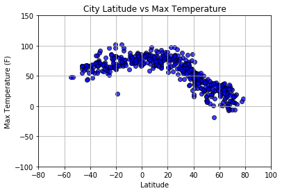
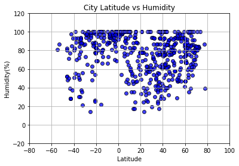
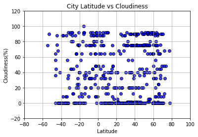
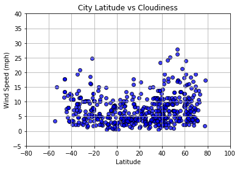

```python
import json
import requests
import pandas as pd
from config import api_key
import random
import citipy
import openweathermapy.core as owm
import numpy as np
units='imperial'
import matplotlib.pyplot as plt
import urllib
```


```python
#Selecting Random Latitudes And Longitudes
Latitude=[]
Longitude=[]
for x in range(15000):
    Latitude.append(random.uniform(-90,90))
for x in range(15000):
    Longitude.append(random.uniform(-180,180))

```


```python
#Extract City Name, Country Code Using CitiPy 
url='http://api.openweathermap.org/data/2.5/weather?'

query_urllist=[]
lat_random=[]
long_random=[]
city_namelist=[]
country_codelist=[]
  
for i in range(10000):

    cityname=(citipy.nearest_city(Latitude[i], Longitude[i]))
    city_namelist.append(cityname.city_name)
    lat_random.append(Latitude[i])
    long_random.append(Longitude[i])
    country_codelist.append(cityname.country_code)
    
city_dict={ 'City':city_namelist,
            'Country Code':country_codelist,
            'Latitude': lat_random,
            'Longitude': long_random
          }
city_dict_df=pd.DataFrame(city_dict)
city_dict_df=city_dict_df.drop_duplicates(["City"])
city_dict_df=city_dict_df.reset_index(drop=True)
print(len(city_dict_df))
# for i in range(len(city_dict_df)):
#     query_url=f"{url}appid={api_key}&units={units}&q="
#     query_urllist.append(query_url+city_dict_df['City'][i].replace(" ", "%20"))
city_dict_df.head()

city_namelist=city_dict_df["City"]
```

    2273


```python
temp=[]
humid=[]
cloud=[]
wind=[]
lat=[]
country=[]
date=[]
lng=[]
max_temp=[]
city=[]

for i, city_value in enumerate(city_namelist):
    query_url= url+"&appid="+api_key+"&units="+units+"&q="+urllib.request.pathname2url(city_value)
    
    try:
        response = requests.get(query_url).json()   
        lat.append(response['coord']['lat'])
        lng.append(response['coord']['lon'])
        country.append(response['sys']['country'])
        city.append(response['name'])
        date.append(response['dt'])
        max_temp.append(response['main']['temp_max'])
        temp.append(response['main']['temp'])
        humid.append(response['main']['humidity'])
        wind.append(response['wind']['speed'])
        cloud.append(response['clouds']['all'])
        print(f"Processing Record {i}: {city_value}")
    except:
        print(city_value + f" not found")
        pass
    if len(city)==500:
        break


```

    Processing Record 0: pevek
    Processing Record 1: provideniya
    Processing Record 2: baijiantan
    Processing Record 3: airai
    Processing Record 4: hasaki
    Processing Record 5: bama
    Processing Record 6: geraldton
    Processing Record 7: buala
    Processing Record 8: ushuaia
    Processing Record 9: puerto ayora
    Processing Record 10: marystown
    Processing Record 11: mastic beach
    Processing Record 12: hilo
    Processing Record 13: bambous virieux
    Processing Record 14: mataura
    Processing Record 15: bluff
    Processing Record 16: busselton
    Processing Record 17: cape town
    Processing Record 18: atar
    cheuskiny not found
    Processing Record 20: punta arenas
    Processing Record 21: ozernovskiy
    Processing Record 22: rikitea
    Processing Record 23: westport
    Processing Record 24: nouadhibou
    Processing Record 25: lebu
    Processing Record 26: albany
    Processing Record 27: voh
    Processing Record 28: milkovo
    Processing Record 29: narsaq
    Processing Record 30: upernavik
    Processing Record 31: barrow
    Processing Record 32: iqaluit
    Processing Record 33: jalu
    Processing Record 34: marfino
    Processing Record 35: laguna
    Processing Record 36: riviere-au-renard
    Processing Record 37: martapura
    Processing Record 38: camacha
    Processing Record 39: dikson
    Processing Record 40: dodoma
    illoqqortoormiut not found
    Processing Record 42: east london
    Processing Record 43: qaanaaq
    Processing Record 44: mahebourg
    Processing Record 45: tura
    Processing Record 46: esna
    Processing Record 47: papanasam
    Processing Record 48: taoudenni
    chagda not found
    Processing Record 50: saint-pierre
    Processing Record 51: saint-philippe
    Processing Record 52: klaksvik
    taolanaro not found
    Processing Record 54: mikuni
    Processing Record 55: new norfolk
    amderma not found
    Processing Record 57: calabozo
    krasnoselkup not found
    Processing Record 59: ambilobe
    toliary not found
    Processing Record 61: mangrol
    Processing Record 62: banda aceh
    Processing Record 63: tuatapere
    Processing Record 64: khudumelapye
    Processing Record 65: chuy
    Processing Record 66: uberlandia
    Processing Record 67: hofn
    Processing Record 68: kedrovyy
    Processing Record 69: marawi
    Processing Record 70: kapaa
    Processing Record 71: illela
    Processing Record 72: nabire
    Processing Record 73: saint george
    Processing Record 74: greenville
    Processing Record 75: gazanjyk
    Processing Record 76: moron
    Processing Record 77: ouesso
    Processing Record 78: tasiilaq
    Processing Record 79: bubaque
    Processing Record 80: roald
    Processing Record 81: atuona
    Processing Record 82: mount isa
    Processing Record 83: butaritari
    Processing Record 84: puerto escondido
    Processing Record 85: boyolangu
    Processing Record 86: jamestown
    Processing Record 87: campbell river
    Processing Record 88: brigantine
    attawapiskat not found
    Processing Record 90: montorio al vomano
    Processing Record 91: virginia beach
    Processing Record 92: tuktoyaktuk
    Processing Record 93: rio grande
    Processing Record 94: saint-georges
    Processing Record 95: saskylakh
    Processing Record 96: yellowknife
    Processing Record 97: bredasdorp
    Processing Record 98: vaini
    Processing Record 99: strezhevoy
    mys shmidta not found
    belushya guba not found
    Processing Record 102: arraial do cabo
    Processing Record 103: komsomolskiy
    Processing Record 104: salinopolis
    Processing Record 105: springdale
    Processing Record 106: marsa matruh
    Processing Record 107: bintulu
    paradwip not found
    Processing Record 109: san patricio
    Processing Record 110: tateyama
    Processing Record 111: grand gaube
    Processing Record 112: manga
    Processing Record 113: nelson bay
    sentyabrskiy not found
    Processing Record 115: polunochnoye
    Processing Record 116: ponta delgada
    Processing Record 117: esperance
    Processing Record 118: panzhihua
    Processing Record 119: port lincoln
    Processing Record 120: bethel
    Processing Record 121: tazovskiy
    Processing Record 122: thompson
    Processing Record 123: tilichiki
    Processing Record 124: ancud
    Processing Record 125: chokurdakh
    Processing Record 126: alyangula
    Processing Record 127: khatanga
    Processing Record 128: maglaj
    Processing Record 129: palmer
    Processing Record 130: puerto el triunfo
    Processing Record 131: victoria
    Processing Record 132: barguzin
    Processing Record 133: itoman
    Processing Record 134: hermanus
    qui nhon not found
    Processing Record 136: pareora
    samusu not found
    Processing Record 138: vila
    Processing Record 139: faanui
    tumannyy not found
    Processing Record 141: sinnamary
    Processing Record 142: gondar
    Processing Record 143: avarua
    Processing Record 144: mar del plata
    Processing Record 145: takoradi
    Processing Record 146: smithers
    Processing Record 147: makakilo city
    Processing Record 148: castro
    Processing Record 149: tarakan
    barentsburg not found
    Processing Record 151: beidao
    Processing Record 152: husavik
    Processing Record 153: carnarvon
    asau not found
    Processing Record 155: cabo san lucas
    Processing Record 156: guerrero negro
    Processing Record 157: khandyga
    vaitupu not found
    Processing Record 159: luderitz
    Processing Record 160: balaguer
    Processing Record 161: ocho rios
    Processing Record 162: pemba
    Processing Record 163: geilo
    Processing Record 164: henties bay
    utiroa not found
    Processing Record 166: diffa
    Processing Record 167: meulaboh
    Processing Record 168: celestun
    karauzyak not found
    Processing Record 170: carmen
    Processing Record 171: chernyshevskiy
    gorno-chuyskiy not found
    tsihombe not found
    Processing Record 174: swan hill
    Processing Record 175: cherskiy
    Processing Record 176: longyearbyen
    Processing Record 177: dunedin
    Processing Record 178: lorengau
    Processing Record 179: fairbanks
    Processing Record 180: bodden town
    Processing Record 181: hamilton
    Processing Record 182: hastings
    ruatoria not found
    Processing Record 184: beitbridge
    Processing Record 185: kaniama
    Processing Record 186: ballina
    Processing Record 187: tecoanapa
    Processing Record 188: garhi khairo
    Processing Record 189: labuhan
    Processing Record 190: singaraja
    Processing Record 191: pyaozerskiy
    Processing Record 192: hithadhoo
    Processing Record 193: yar-sale
    Processing Record 194: gold coast
    Processing Record 195: bedele
    Processing Record 196: leningradskiy
    Processing Record 197: notodden
    Processing Record 198: ayolas
    Processing Record 199: pacific grove
    Processing Record 200: qandala
    Processing Record 201: mount gambier
    udalo not found
    Processing Record 203: port elizabeth
    Processing Record 204: saldanha
    allanmyo not found
    Processing Record 206: port alfred
    Processing Record 207: jiazi
    Processing Record 208: whitehorse
    Processing Record 209: altay
    Processing Record 210: eureka
    Processing Record 211: semnan
    Processing Record 212: antofagasta
    Processing Record 213: ixtapa
    Processing Record 214: moga
    Processing Record 215: yafran
    Processing Record 216: ribeira grande
    Processing Record 217: peniche
    Processing Record 218: arzgir
    Processing Record 219: emerald
    Processing Record 220: diego de almagro
    Processing Record 221: kilkis
    Processing Record 222: cabedelo
    azad shahr not found
    Processing Record 224: vizinga
    Processing Record 225: richards bay
    Processing Record 226: tiksi
    temaraia not found
    Processing Record 228: hobyo
    Processing Record 229: mountain home
    Processing Record 230: sao filipe
    Processing Record 231: takapau
    Processing Record 232: uvinza
    Processing Record 233: kudahuvadhoo
    Processing Record 234: georgetown
    Processing Record 235: nome
    Processing Record 236: carlyle
    Processing Record 237: sitka
    Processing Record 238: harper
    galgani not found
    Processing Record 240: san
    Processing Record 241: huatulco
    Processing Record 242: port moresby
    Processing Record 243: eufaula
    Processing Record 244: pesaro
    umzimvubu not found
    Processing Record 246: souillac
    Processing Record 247: jackson
    Processing Record 248: qaqortoq
    lolua not found
    grand river south east not found
    Processing Record 251: zhigansk
    Processing Record 252: roma
    Processing Record 253: alghero
    Processing Record 254: taungdwingyi
    Processing Record 255: galveston
    Processing Record 256: kaitangata
    Processing Record 257: fortuna
    Processing Record 258: abu samrah
    Processing Record 259: ust-kan
    nizhneyansk not found
    asfi not found
    olafsvik not found
    Processing Record 263: hobart
    Processing Record 264: ponta do sol
    Processing Record 265: butembo
    Processing Record 266: popricani
    Processing Record 267: turukhansk
    Processing Record 268: mindelo
    Processing Record 269: derzhavinsk
    Processing Record 270: general roca
    marcona not found
    Processing Record 272: helong
    Processing Record 273: praia
    Processing Record 274: mehamn
    Processing Record 275: rawson
    Processing Record 276: kavaratti
    Processing Record 277: pisco
    Processing Record 278: ostrovnoy
    Processing Record 279: petropavlovsk-kamchatskiy
    Processing Record 280: fort-shevchenko
    Processing Record 281: palana
    Processing Record 282: flinders
    Processing Record 283: namatanai
    Processing Record 284: huehuetan
    Processing Record 285: kalabo
    Processing Record 286: ust-karsk
    Processing Record 287: kodiak
    bengkulu not found
    Processing Record 289: vao
    ambodifototra not found
    Processing Record 291: leshukonskoye
    Processing Record 292: kavieng
    Processing Record 293: ulladulla
    Processing Record 294: mitzic
    Processing Record 295: norman wells
    Processing Record 296: port augusta
    Processing Record 297: vestmannaeyjar
    Processing Record 298: mwingi
    korla not found
    Processing Record 300: iquique
    Processing Record 301: paamiut
    Processing Record 302: batemans bay
    Processing Record 303: chkalovsk
    Processing Record 304: bilibino
    bokspits not found
    Processing Record 306: xining
    Processing Record 307: cururupu
    Processing Record 308: katsuura
    Processing Record 309: raudeberg
    kawana waters not found
    Processing Record 311: ambon
    Processing Record 312: mayo
    bairiki not found
    Processing Record 314: prieska
    Processing Record 315: kindu
    Processing Record 316: talnakh
    Processing Record 317: christchurch
    Processing Record 318: bathsheba
    Processing Record 319: radha kund
    Processing Record 320: sioux lookout
    Processing Record 321: yulara
    Processing Record 322: arman
    Processing Record 323: smirnykh
    Processing Record 324: mujiayingzi
    Processing Record 325: taltal
    Processing Record 326: namibe
    Processing Record 327: verkhnyaya balkariya
    Processing Record 328: nikolskoye
    Processing Record 329: along
    Processing Record 330: miyako
    Processing Record 331: gat
    Processing Record 332: mopipi
    saleaula not found
    Processing Record 334: thunder bay
    Processing Record 335: challapata
    Processing Record 336: nobeoka
    Processing Record 337: novochernorechenskiy
    Processing Record 338: fredericton
    Processing Record 339: ilulissat
    Processing Record 340: basco
    Processing Record 341: boa vista
    Processing Record 342: port keats
    Processing Record 343: newnan
    Processing Record 344: kununurra
    Processing Record 345: launceston
    Processing Record 346: brae
    khonsar not found
    Processing Record 348: broome
    Processing Record 349: corato
    Processing Record 350: yemtsa
    Processing Record 351: isilkul
    Processing Record 352: navahrudak
    Processing Record 353: sarti
    rawah not found
    Processing Record 355: gubkinskiy
    Processing Record 356: mugur-aksy
    Processing Record 357: usinsk
    Processing Record 358: zaysan
    Processing Record 359: lagoa
    Processing Record 360: vardo
    Processing Record 361: baoding
    Processing Record 362: santa rosa
    Processing Record 363: chibombo
    Processing Record 364: araguaina
    Processing Record 365: kars
    Processing Record 366: saint-augustin
    Processing Record 367: desur
    Processing Record 368: puerto carreno
    Processing Record 369: bulawayo
    Processing Record 370: pedro carbo
    Processing Record 371: shache
    Processing Record 372: bangkal
    Processing Record 373: tamandare
    tabiauea not found
    Processing Record 375: pakdasht
    Processing Record 376: ahipara
    Processing Record 377: soyo
    Processing Record 378: iskateley
    Processing Record 379: portland
    Processing Record 380: udachnyy
    Processing Record 381: dakar
    Processing Record 382: tual
    machali not found
    Processing Record 384: kailua
    Processing Record 385: oga
    Processing Record 386: cooma
    Processing Record 387: bulungu
    ngukurr not found
    Processing Record 389: apollonia
    Processing Record 390: southbridge
    bur gabo not found
    Processing Record 392: jumla
    Processing Record 393: catuday
    Processing Record 394: orange cove
    Processing Record 395: imeni babushkina
    Processing Record 396: batagay
    Processing Record 397: mayskiy
    Processing Record 398: manhattan
    Processing Record 399: maloy
    Processing Record 400: mahibadhoo
    Processing Record 401: goundam
    Processing Record 402: ossora
    Processing Record 403: marsh harbour
    Processing Record 404: ponte nova
    Processing Record 405: peace river
    Processing Record 406: ukiah
    Processing Record 407: port hardy
    Processing Record 408: adwa
    sataua not found
    Processing Record 410: constitucion
    Processing Record 411: vanavara
    Processing Record 412: erzin
    Processing Record 413: bonnyville
    Processing Record 414: sur
    Processing Record 415: jiwani
    Processing Record 416: umm lajj
    Processing Record 417: yabrud
    Processing Record 418: lompoc
    maarianhamina not found
    Processing Record 420: verkhnevilyuysk
    Processing Record 421: evensk
    Processing Record 422: mazara del vallo
    Processing Record 423: codrington
    Processing Record 424: nagato
    Processing Record 425: caravelas
    Processing Record 426: riyadh
    Processing Record 427: vila franca do campo
    Processing Record 428: pucallpa
    marv dasht not found
    Processing Record 430: cidreira
    Processing Record 431: jiaocheng
    Processing Record 432: itaituba
    Processing Record 433: honiara
    Processing Record 434: aleksandro-nevskiy
    Processing Record 435: ciudad bolivar
    Processing Record 436: palimbang
    Processing Record 437: kahului
    Processing Record 438: vanimo
    Processing Record 439: mackay
    Processing Record 440: berlevag
    Processing Record 441: merrill
    tapaua not found
    Processing Record 443: ihosy
    Processing Record 444: wanaka
    Processing Record 445: sao joao da barra
    Processing Record 446: ichinohe
    Processing Record 447: diebougou
    Processing Record 448: surt
    Processing Record 449: tessalit
    Processing Record 450: aklavik
    Processing Record 451: vila velha
    Processing Record 452: mandali
    Processing Record 453: luganville
    Processing Record 454: maroantsetra
    Processing Record 455: ondjiva
    Processing Record 456: anloga
    Processing Record 457: suluq
    Processing Record 458: foki
    hvammstangi not found
    Processing Record 460: nemuro
    Processing Record 461: medea
    Processing Record 462: pundaguitan
    Processing Record 463: wanning
    Processing Record 464: velikodvorskiy
    Processing Record 465: bognor regis
    Processing Record 466: muli
    kuah not found
    Processing Record 468: orlik
    Processing Record 469: maniitsoq
    santamaria orlea not found
    Processing Record 471: gondanglegi
    Processing Record 472: uglich
    Processing Record 473: grindavik
    Processing Record 474: miandoab
    Processing Record 475: san pedro de uraba
    Processing Record 476: corinto
    Processing Record 477: megion
    Processing Record 478: kaarina
    Processing Record 479: santiago del estero
    Processing Record 480: karratha
    Processing Record 481: yumen
    Processing Record 482: sorland
    Processing Record 483: shibetsu
    Processing Record 484: tanout
    Processing Record 485: mocuba
    Processing Record 486: yushan
    Processing Record 487: salalah
    Processing Record 488: necochea
    pemangkat not found
    Processing Record 490: kaihua
    Processing Record 491: rincon
    Processing Record 492: igrim
    Processing Record 493: rapid valley
    Processing Record 494: gimli
    Processing Record 495: mbigou
    Processing Record 496: wuwei
    Processing Record 497: shuangcheng
    Processing Record 498: stari bohorodchany
    aflu not found
    Processing Record 500: severo-yeniseyskiy
    Processing Record 501: mogadishu
    matto not found
    Processing Record 503: balabac
    Processing Record 504: newburyport
    Processing Record 505: gayeri
    Processing Record 506: viedma
    Processing Record 507: severo-kurilsk
    Processing Record 508: cabimas
    Processing Record 509: xinxiang
    Processing Record 510: wagar
    Processing Record 511: vilhena
    Processing Record 512: san ramon
    Processing Record 513: huarmey
    Processing Record 514: aloleng
    Processing Record 515: xuanhua
    Processing Record 516: kroonstad
    Processing Record 517: margate
    Processing Record 518: boralday
    Processing Record 519: kikwit
    Processing Record 520: omboue
    Processing Record 521: carambei
    Processing Record 522: ambanja
    Processing Record 523: kolno
    Processing Record 524: marzuq
    Processing Record 525: sola
    Processing Record 526: maltahohe
    Processing Record 527: bahia blanca
    Processing Record 528: ketchikan
    urumqi not found
    Processing Record 530: srivardhan
    Processing Record 531: chhatak
    Processing Record 532: onega
    kazalinsk not found
    Processing Record 534: dali
    stornoway not found
    Processing Record 536: la ronge
    achisay not found
    Processing Record 538: aykhal
    Processing Record 539: kruisfontein
    Processing Record 540: nirasaki
    Processing Record 541: coquimbo
    Processing Record 542: bandarbeyla
    taburao not found
    Processing Record 544: silver city
    xiangdong not found
    Processing Record 546: lanxi
    Processing Record 547: boulder
    Processing Record 548: kerman
    Processing Record 549: aksarka
    Processing Record 550: ustrzyki dolne
    Processing Record 551: grand-santi
    andenes not found
    Processing Record 553: touros
    Processing Record 554: mbengwi
    Processing Record 555: chapada dos guimaraes
    Processing Record 556: buchanan
    Processing Record 557: sungaipenuh
    Processing Record 558: gisborne
    Processing Record 559: gamboma
    haibowan not found
    Processing Record 561: clyde river
    Processing Record 562: sompeta
    Processing Record 563: oranjemund
    bantry not found
    Processing Record 565: manggar
    Processing Record 566: dubbo


```python
weather_dict={'City':city,
            "Lat": lat,
            "Temp": temp,
            "Humidity": humid,
            "Wind Speed": wind,
            "Cloudiness": cloud,
            "Lng":lng,
            "Date":date,
            "Country":country,
            "Max Temp":max_temp
             }
weather_data = pd.DataFrame(weather_dict)
weather_data.head()


```


<div>
<style scoped>
    .dataframe tbody tr th:only-of-type {
        vertical-align: middle;
    }

    .dataframe tbody tr th {
        vertical-align: top;
    }

    .dataframe thead th {
        text-align: right;
    }
</style>
<table border="1" class="dataframe">
  <thead>
    <tr style="text-align: right;">
      <th></th>
      <th>City</th>
      <th>Cloudiness</th>
      <th>Country</th>
      <th>Date</th>
      <th>Humidity</th>
      <th>Lat</th>
      <th>Lng</th>
      <th>Max Temp</th>
      <th>Temp</th>
      <th>Wind Speed</th>
    </tr>
  </thead>
  <tbody>
    <tr>
      <th>0</th>
      <td>Pevek</td>
      <td>0</td>
      <td>RU</td>
      <td>1522645955</td>
      <td>74</td>
      <td>69.70</td>
      <td>170.27</td>
      <td>27.94</td>
      <td>27.94</td>
      <td>15.23</td>
    </tr>
    <tr>
      <th>1</th>
      <td>Provideniya</td>
      <td>75</td>
      <td>RU</td>
      <td>1522643400</td>
      <td>100</td>
      <td>64.42</td>
      <td>-173.23</td>
      <td>32.00</td>
      <td>32.00</td>
      <td>6.71</td>
    </tr>
    <tr>
      <th>2</th>
      <td>Baijiantan</td>
      <td>8</td>
      <td>CN</td>
      <td>1522645957</td>
      <td>91</td>
      <td>45.63</td>
      <td>85.18</td>
      <td>40.09</td>
      <td>40.09</td>
      <td>6.85</td>
    </tr>
    <tr>
      <th>3</th>
      <td>Airai</td>
      <td>32</td>
      <td>TL</td>
      <td>1522645958</td>
      <td>73</td>
      <td>-8.93</td>
      <td>125.41</td>
      <td>80.95</td>
      <td>80.95</td>
      <td>0.58</td>
    </tr>
    <tr>
      <th>4</th>
      <td>Hasaki</td>
      <td>40</td>
      <td>JP</td>
      <td>1522643400</td>
      <td>56</td>
      <td>35.73</td>
      <td>140.83</td>
      <td>71.60</td>
      <td>68.27</td>
      <td>11.41</td>
    </tr>
  </tbody>
</table>
</div>


```python
#City Latitude vs Max Temperature

plt.scatter(weather_data['Lat'], weather_data['Max Temp'],facecolors='blue', edgecolors='black', alpha=0.75 )

plt.grid()
#plt.set_facecolor("lightslategray")
plt.xlabel("Latitude")
plt.ylabel("Max Temperature (F)")
plt.ylim(-100,150)
plt.xlim(-80,100)
plt.title("City Latitude vs Max Temperature")#+ "("+weather_data['Date']+")")

```


    Text(0.5,1,'City Latitude vs Max Temperature')





```python
#City Latitude vs Humidity
plt.scatter(weather_data['Lat'], weather_data['Humidity'],facecolors='blue', edgecolors='black', alpha=0.75 )

plt.grid()
#plt.set_facecolor("lightslategray")
plt.xlabel("Latitude")
plt.ylabel("Humidity(%)")
plt.ylim(-20,120)
plt.xlim(-80,100)
plt.title("City Latitude vs Humidity")#+ "("+weather_data['Date']+")")
```


    Text(0.5,1,'City Latitude vs Humidity')





```python
#Latitude vs Cloudiness
plt.scatter(weather_data['Lat'], weather_data['Cloudiness'],facecolors='blue', edgecolors='black', alpha=0.75 )

plt.grid()
#plt.set_facecolor("lightslategray")
plt.xlabel("Latitude")
plt.ylabel("Cloudiness(%)")
plt.ylim(-20,120)
plt.xlim(-80,100)
plt.title("City Latitude vs Cloudiness")
```


    Text(0.5,1,'City Latitude vs Cloudiness')





```python
#Latitude vs Wind Speed
plt.scatter(weather_data['Lat'], weather_data['Wind Speed'],facecolors='blue', edgecolors='black', alpha=0.75 )

plt.grid()
#plt.set_facecolor("lightslategray")
plt.xlabel("Latitude")
plt.ylabel("Wind Speed (mph)")
plt.ylim(-5,40)
plt.xlim(-80,100)
plt.title("City Latitude vs Cloudiness")#+ "("+weather_data['Date']+")")
```


    Text(0.5,1,'City Latitude vs Cloudiness')





```python
weather_data.to_csv("Weather_Report.csv", encoding='utf-8')
```
